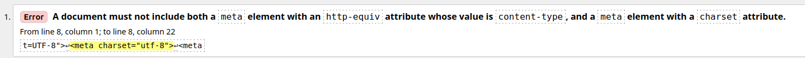
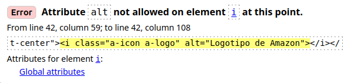
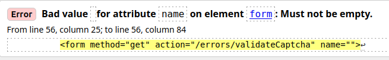
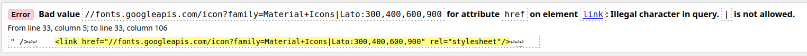
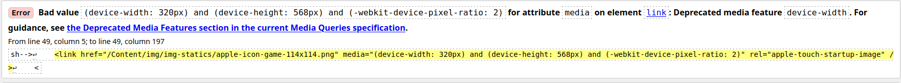
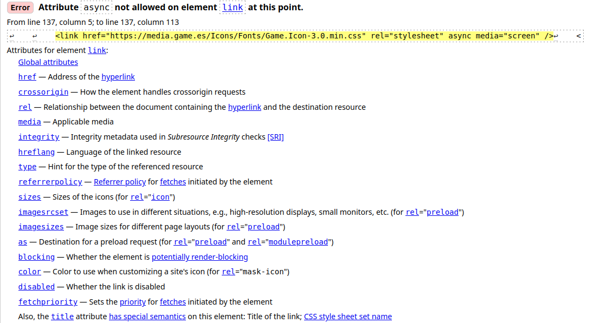
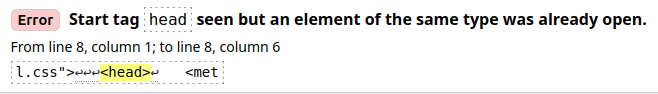
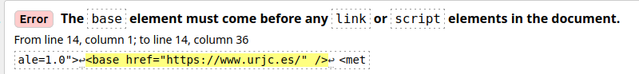
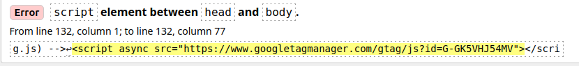
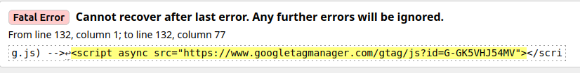

# Práctica 1: Prácticas de HTML

## Práctica 1.2. Inconsistencias en la web
#### Ejemplos de inconsistencias (Tú vs Usted)
- **Google y Gmail:**
  Es muy común verlo en la gestión de la cuenta. En el menú 
  principal aparece **"Gestionar tu cuenta de Google"** (tuteo),
  pero al entrar en opciones de seguridad o privacidad, cambian
  al usted con frases como **"Revise la configuración de su cuenta"**
  o **"Proteja su privacidad"**.

- **PayPal:**
  En la pantalla de inicio suelen usar un tono cercano:
  **"Hola, aquítienes tu resumen"** o **"Envía dinero a tus amigos"**.
  Sin embargo, en las opciones de configuración bancaria cambian
  el tono a **"Asocie su cuenta bancaria"** o **"Confirme su identidad"**.

- **Windows / Microsoft:**
  El sistema operativo mezcla constantemente. Te encuentras opciones
  como **"Personaliza tu PC"** o **"Tu teléfono"**, pero cuando hay
  una actualización crítica, el mensaje pasa a ser formal:
  **"No apague su equipo"** o **"Espere mientras configuramos su PC"**.

- **Tiendas online:**
  En muchas tiendas de ropa o tecnología, el carrito se llama **"Tu cesta"**
  o **"Tus artículos"**. Sin embargo, el botón final para pagar a menudo dice
  **"Realice su pedido"** o **"Introduzca sus datos de envío"**, mezclando
  ambas formas en el mismo proceso de compra.

## Práctica 1.3. W3C Validator
Voy a checkear las paginas webs de Amazon, Game y URJC

### AMAZON
#### Error 1

- El error indica que en el HTML hay dos elementos del tipo meta
 que están en conflicto:
    - Un `<meta>` con `http-equiv="content-type"`
    - Otro `<meta>` con el atributo `charset`
- En HTML5 no podemos tener ambos al mismo tiempo en el mismo documento,
ya que ambos definen la codificación de caracteres del documento.

- Para solucionarlo podemos mantener solo la versión moderna de HTML5:
    - `html<meta charset="utf-8">`

#### Error 2

- El error indica que el atributo alt no está permitido en el elemento
`<i>` en esa posición del código.
- El atributo alt solo se puede usar en elementos de imagen como
``, `<area>` e `<input type="image">`. El elemento `<i>` es para 
texto en itálica.

- Para solucionarlo en este caso, como se trata del logo de Amazón el cual
tiene que ser accesible para lectores de pantalla podriamos usar `aria-label`
que es un atributo de accesibilidad que proporciona una etiqueta de texto para
elementos que no tienen texto visible, especialmente para lectores de pantalla
(software que usan personas con discapacidad visual)

#### Error 3

- El error dice que el atributo name del elemento `<form>` tiene un valor vacío,
 y eso no está permitido. Si usamos el atributo name, debe tener un valor.

- Para el caso de Amazon, probablemente lo mejor para solucionar el error sea
eliminar el atributo `name` ya que en formularios no es obligatorio y
raramente se usa hoy en día (se prefiere usar id para referenciar elementos).

### GAME
#### Error 1

- El error indica que hay un carácter **|**  en la URL del atributo href,
y ese carácter no está permitido en URLs sin codificar.

- Para arreglarlo debemos codificar el carácter **|** como `%7C` en la URL

#### Error 2

- Este error indica que se esta usando caracteristicas obsoetas en las
 especificaciones modernas de CSS. Estos valores obsoletos son:
    - `device-width`
    - `device-height`
    - `-webkit-device-pixel-ratio`

- Para solucionar este error deberemos cambiar las caracteristicas obsoletas
por estas actualizadas:
    - `device-width` --> `width`
    - `device-height` --> `height`
    - `-webkit-device-pixel-ratio` --> `resolution: 2dppx`

#### Error 3

- Este error nos idica que el atributo *async* no está permitido en el elemento
`<link>`. El atributo *async* solo funciona en elementos `<script>`, no en
 `<link>`

- Para corregirlo podemos quitar simplemente el atributo *async* o tambien usar
la tecnica *preload* de esta forma `rel="preload"`

### URJC
#### Error 1

- El error dice que se encontró una etiqueta `<head>` cuando ya había una
abierta. Es decir, hay dos etiquetas `<head>` en el mismo documento, y eso
no está permitido.

- Para solucionarlo debemos de quitar el `<head>` duplicado

#### Error 2

- El elemento `<base>` debe aparecer antes que cualquier elemento `<link>`
o `<script>` en el documento. En este caso, hay `<link>` o `<script>` que
aparecen antes del `<base>`.

- Para solucionarlo debemos de poner el elemento `<base>` debe ser el primer
elemento dentro del elemento `<head>`

#### Error 3

- El error indica que hay un elemento `<script>` colocado entre el `</head>`
y el `<body>`, y eso no está permitido. Todo elemento debe estar dentro de
una sección válida del HTML.

- Para solucionarlo podriamos hacer 2 cosas, o mover el `<script>` dentro del
`<head>` o moverlo dentro del `<body>`

#### Error 4

- Este no es un error de código en sí mismo. Es un mensaje que dice que el
validador no puede continuar analizando el documento después del error
anterior (el del `<script>` entre `<head>` y `<body>`).
- El error anterior era tan grave que rompió el parser del validador y todo
lo que venga después ya no se analizará

- Para arreglarlo simplemente habria que solucionar el **Error 3**

## Práctica 1.4. Elementos HTML

### Comportamiento del atributo target="_blank"

Tras probar el enlace con `target="_blank"` en distintos navegadores actuales (como Google Chrome o
Mozilla Firefox), he observado lo siguiente:

El comportamiento por defecto en todos ellos es abrir el enlace en una **nueva pestaña** dentro de
la misma ventana del navegador, en lugar de abrir una **nueva ventana** independiente. 

Esto demuestra que, aunque `target="_blank"` le indica al navegador que debe abrir un "nuevo
contexto de navegación", los navegadores modernos están configurados por defecto para priorizar
la navegación por pestañas. En última instancia, es la configuración del propio navegador
(o las preferencias del usuario) la que decide si ese nuevo contexto será una pestaña
o una ventana nueva, por lo que HTML no puede obligar a que sea estrictamente una ventana.
